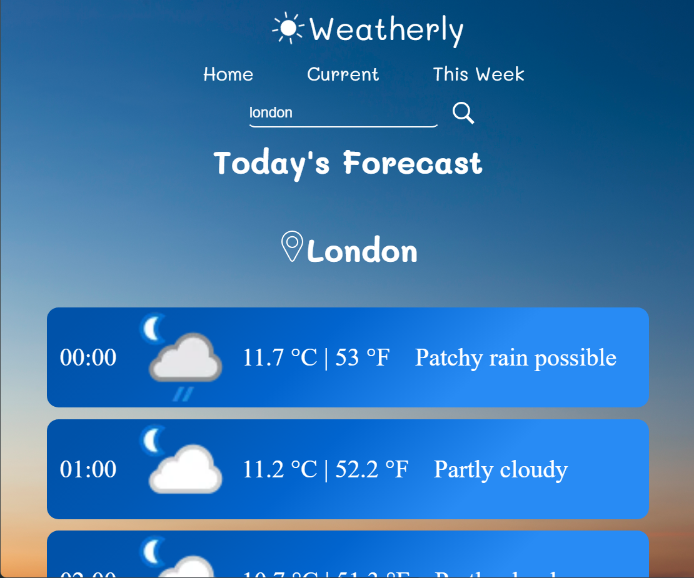

# 🌦️ Weatherly



Weatherly is a web application that integrates the Weather API. It provides up-to-date weather data for any city, state, zip code, and country. Weatherly delivers comprehensive weather forecasts that includes: local time, date, current conditions, daily & weekly forecasts, and temperatures in degrees Celsius and Fahrenheit.

## File Structure
```
.
├── LICENSE.md
├── README.md
├── config
|   ├── .env
├── scripts.js
├── css
|   ├── media
|   |   ├── ...
|   ├── styles.css
├── index.html
├── index.html
├── current.html
├── today.html
├── week.html
```

## Tech & Features
* HTML
* CSS
* Flexbox
* JavaScript
* JavaScript Module
* Google Fonts API
* Fetch API
* JSON
* DOM Manipulation
* Error Handling
* Responsive & Interactive Design
* Web Accessbility
* SEO Optimization
* Netlify Deployment

## Resources & Acknowledgements
* [Weather API](https://www.weatherapi.com/)
* [Abdullah Al Faysal](https://www.vecteezy.com/video/31393582-the-skye-blue-time-lapse-at-countryside
)
* [Prasong Takham](https://www.vecteezy.com/photo/6893351-beautiful-sunset-sky-abstract-background)
* [Google Fonts](https://fonts.google.com/)
* [ICONS8](https://icons8.com/)
* [Netlify](https://www.netlify.com/)
